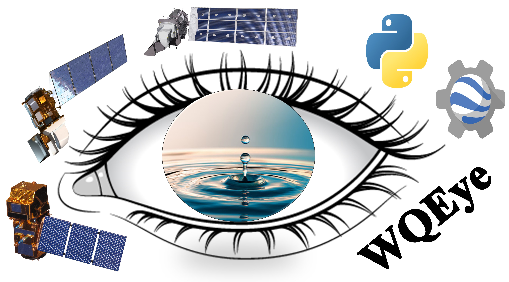

  

# WQEye: A Python-based Software Aided by Google Earth Engine for Machine Learning-based Retrieval of Water Quality Parameters from Sentinel-2 and Landsat-8/9 Remote Sensing Data

🛑 **important**: This repository contains an incomplete version of WQEye, as the corresponding paper is currently under review. The full code will be released upon acceptance. For software illustrations, please refer to [here](docs/Step-by-Step.pdf).

## 1. Software Documentation

💻 **System Requirements** are fully described [here](docs/SystemRequirements.pdf).

🛠️ For installation instructions, refer to the **Installation Guide** [here](docs/Installation.pdf).

📚 A detailed **Step-by-Step Tutorial** can be found [here](docs/Step-by-Step.pdf).

