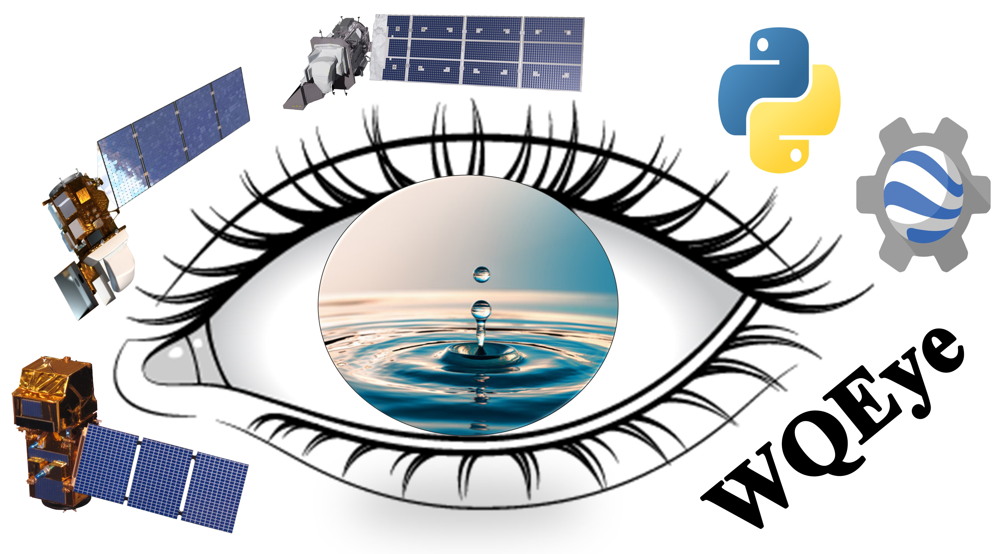
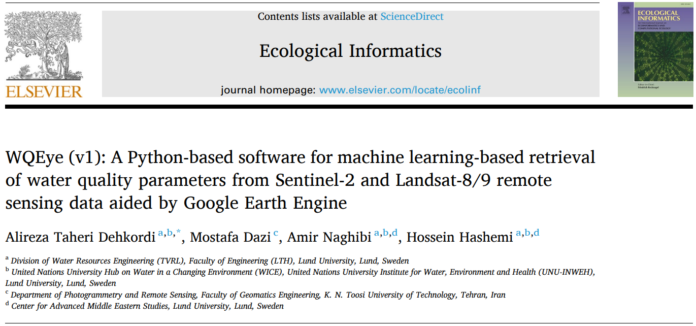

> 🛑 **Important:** This software is provided for research purposes only. Any commercial use, including but not limited to commercial products, services, consulting, or internal business use, is strictly prohibited.

🛑 **important**: Please cite this paper if you are using the codes and data provided: https://doi.org/10.1016/j.ecoinf.2026.103692

  

### WQEye: A Python-based Software Aided by Google Earth Engine for Machine Learning-based Retrieval of Water Quality Parameters from Sentinel-2 and Landsat-8/9 Remote Sensing Data
🛑 **important**: Please cite this paper if you are using the codes and data provided: https://doi.org/10.1016/j.ecoinf.2026.103692

  

---------------------------------------------------------------------------------------------

### 📝 Software Documentation

💻 **System Requirements** are fully described [here](docs/SystemRequirements.pdf).

🛠️ For installation instructions, refer to the **Installation Guide** [here](docs/Installation.pdf).

📚 A detailed **Step-by-Step Tutorial** can be found [here](docs/Step-by-Step.pdf).

🔑 Before running the software, you must provide **GEE user credentials**. A full guide can be found [here](docs/GEEusercredential.pdf).

---------------------------------------------------------------------------------------------

### 📁 Getting Started with Sample Data (Input Data Format)

Two sample datasets are included with this repository ([here](example/)) to help you get started with **WQEye**. 
These datasets provides dense time series **Chl-a** and **turbidity** measurements from in-situ USGS stations in USA.
They allow you to run the software, test its functionalities, and follow the tutorial, even if you don't have your own data yet. You can also prepare your own in-situ measurmeent data based on the format provided. 

---------------------------------------------------------------------------------------------

### 👨‍💻 Development Team and Contact

- **Alireza Taheri Dehkordi** — Lund University, Lund, Sweden.
- **Mostafa Dazi** — K. N. Toosi Univeristy of Technology, Tehran, Iran. 

📧 For questions or inquiries, please contact: [alireza.taheri_dehkordi@tvrl.lth.se] and [mostafa.dazi@email.kntu.ac.ir]

---------------------------------------------------------------------------------------------

### 🙏 Acknowledgements

We gratefully acknowledge the entire open-source community that made the development of **WQEye** possible. Specific thanks to the following tools:

- 🖥️ **[Streamlit](https://streamlit.io/)** — for building interactive web applications.  
- 🌍 **[geemap](https://geemap.org/)** — for accessing and interacting with Google Earth Engine.

🛑 **important**: Please cite this paper if you are using the codes and data provided: https://doi.org/10.1016/j.ecoinf.2026.103692
